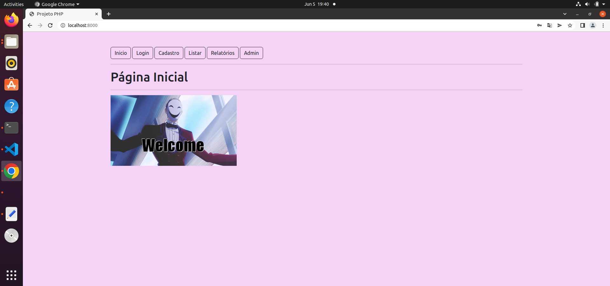
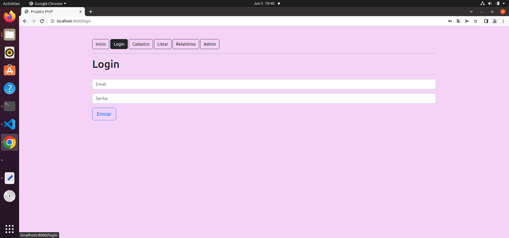
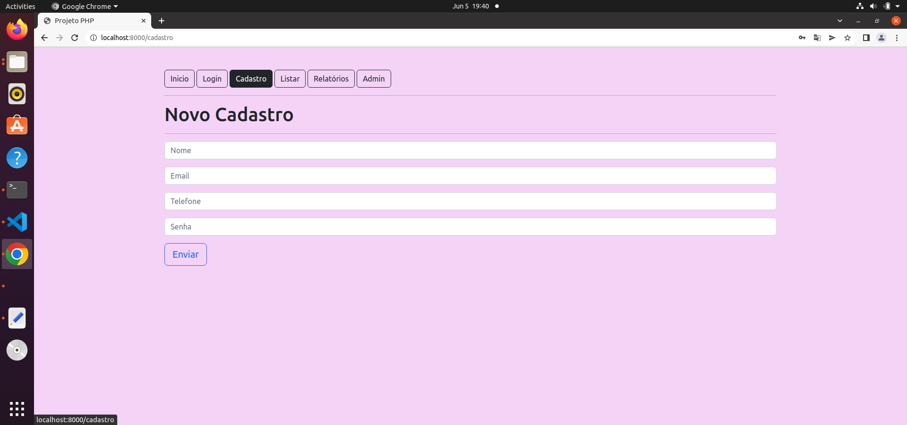
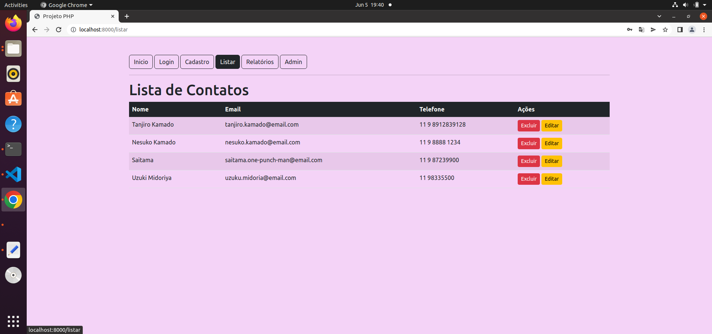

# Projeto CRUD Contatos
Projeto proposto no Módulo de Introdução ao PHP do programa devstar, que consiste em um cadastro de contatos.
Nele é possível:
- adicionar um contato(nome, email, telefone, senha)
- excluir um contato
- editar um contato


Devstar é um programa da Paylivre em parceria com a Be academy, afim de capacitar os participantes na linguagem
de programação PHP, além das softskills exigidas pelo mercado.

Os exercícios propostos foram todos feitos em PHP.

## Instalação

Para realizar a execução dos exercícios propostos, se faz necessária a instalação do php.

**Instalação no Linux(Debian/Ubuntu)**


**Passo 1.** Abra um terminal;

**Passo 2.** Instale os seguintes pacotes necessários;
```bash
 sudo apt-get install software-properties-common
```
**Passo 3.** Em seguida, adicione o repositório do software;

```bash
 sudo add-apt-repository ppa:ondrej/php
```

**Passo 4.** Depois disso, atualize o APT;

```bash
sudo apt update
```

**Passo 5.** Instale o PHP 8:
```bash
sudo apt install php8.0
```

**Passo 5.** Verifique se foi instalado corretamente:

*Ao executar este comando o terminal deve exibir a versão do php instalado.*
```bash
php -v
```

**Instalação no Windows**

**Passo 1.** Realize o download do PHP no [site oficial do php](https://www.php.net/downloads.php)

*Recomenda-se a versão 7.1 ou superior*

**Passo 2.** Descompacte o arquivo na sua partição principal e renomeie para php

**Passo 3.** Em seguida, configure as variáveis de ambiente:
* Abra o painel de controle
* Vá em sistema
* Selecione a guia avançado
* clique em Variáveis de ambiente no rodapé da janela
* Na sessão Variáveis do sistema, selecione Path
* Clique em editar
* Em valor da variável, no final do texto ou na última linha acrescente o caminho onde está a pasta php (Ex: C:\php)
* Confirme se é o caminho correto e clique em ok

**Passo 4.** Se faz necessário a configuração do arquivo host para apontar o nome localhost para 127.0.0.1
* Abra o menu iniciar
* com o botão direito do mouse clique em "Executar como administrador" no seu editor de texto
* clique na opção abrir
* no caminho da pasta digite *C:\Windows\System32\drivers\etc.*
* Abra o arquivo *host*, caso não apareça, selecione a opção *Todos os arquivos* 
* Verifique se existe a linha 127.0.0.1 *localhost*
* Caso não exista a linha acima, acrescente-a (caso haja dúvidas consulte a sessão Referência)

**Passo 5.** Abra o seu terminal e digite:

*Ao executar este comando o terminal deve exibir a versão do php instalado.*
```bash
php --version
```

## Exercícios

Para executar os exercícios, após a instalação do php em sua máquina, siga os passos a seguir
- Clone este repositório
- abra o seu terminal e navegue até a pasta logica-programacao
- execute o seguinte comando para iniciar o servidor local php:

```bash
    php -S localhost:8000 -t [nome da pasta que contem o exercicio]
    Ex: php -S localhost:8000 -t exercicio01
```
Para executar outro exercício, é necessário encerrar a execução anterior:
```bash
    pkill -9 php
```
inicie o servidor novamente com o nome da pasta do exercício
```bash
    php -S localhost:8000 -t [nome da pasta que contem o exercicio]
    
```

[Projeto](projeto/) 


## Screenshot telas do Projeto
Home


Login
 

Cadastro
 

Lista de Contatos
 

## Referência

 - [Instalação PHP Linux](https://www.edivaldobrito.com.br/como-instalar-o-php-8-no-ubuntu-e-sistemas-derivados/)
 - [Instalação PHP Windows](https://blog.schoolofnet.com/como-instalar-o-php-no-windows-do-jeito-certo-e-usar-o-servidor-embutido/)
 - [Documentação PHP](https://www.php.net/manual/pt_BR/index.php)
